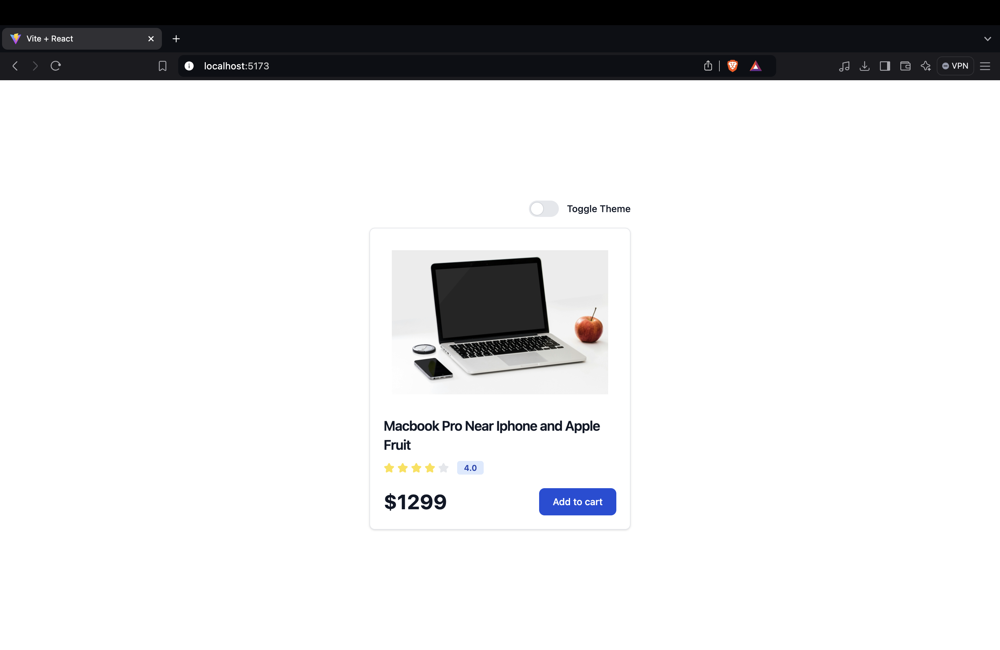
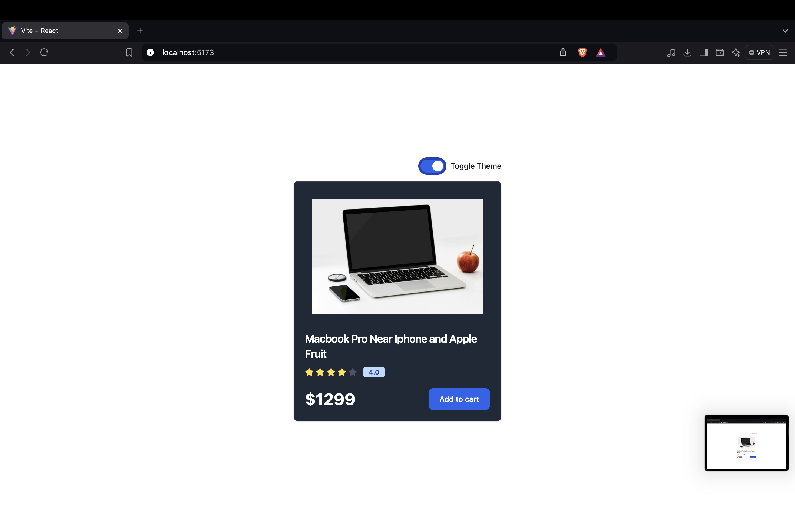

# 🌗 Theme Switcher

Welcome to the **Theme Switcher** project! This web-based application allows users to switch between different themes, enhancing the user experience by providing personalized design choices. Built with **React**, this app offers a seamless way to toggle between light and dark modes or any other custom themes you may wish to add.

## 🚀 Features

- **Multiple Themes**: Switch between themes like light mode, dark mode, or other custom styles.
- **Live Theme Toggle**: Instantly see changes as you toggle between themes.
- **Responsive Design**: The application is fully responsive across all screen sizes.
- **Customizable**: Easily add more themes by modifying the theme styles.
- **Persistent Theme**: User-selected theme persists across sessions using local storage.

## 🛠️ Technologies Used

- **React**: A JavaScript library for building user interfaces.
- **CSS/SCSS**: For styling the themes and the overall application.
- **LocalStorage**: To store the theme preferences.

## 🖼️ Screenshots




## 📦 Installation and Setup

To run this project locally, follow these steps:

1. **Clone the repository**:

   ```bash
   git clone https://github.com/Shravan250/React-Projects.git
   cd React-Projects/themeSwitcher
   ```

2. **Install dependencies**:

   ```bash
   npm install
   ```

3. **Start the development server**:

   ```bash
   npm run dev
   ```

4. Open your browser and navigate to `http://localhost:5173` to use the app.

## 🔄 Usage

1. Open the application.
2. Toggle between the available themes using the switch/button provided in the UI.
3. The selected theme will persist across page reloads.

## 🛠️ Customization

To add more themes:

1. Go to the themes directory in the project.
2. Add the new theme styles in the respective CSS/SCSS files.
3. Update the theme toggle logic in the ThemeContext to include the new theme.

## 🤝 Contributing

Contributions are welcome! If you'd like to contribute:

1. Fork the repository.
2. Create a new branch.
3. Submit a pull request with your changes.

We appreciate any contributions that help make this project better!

## 📄 License

This project is licensed under the MIT License. Feel free to use and modify it as needed.

---
