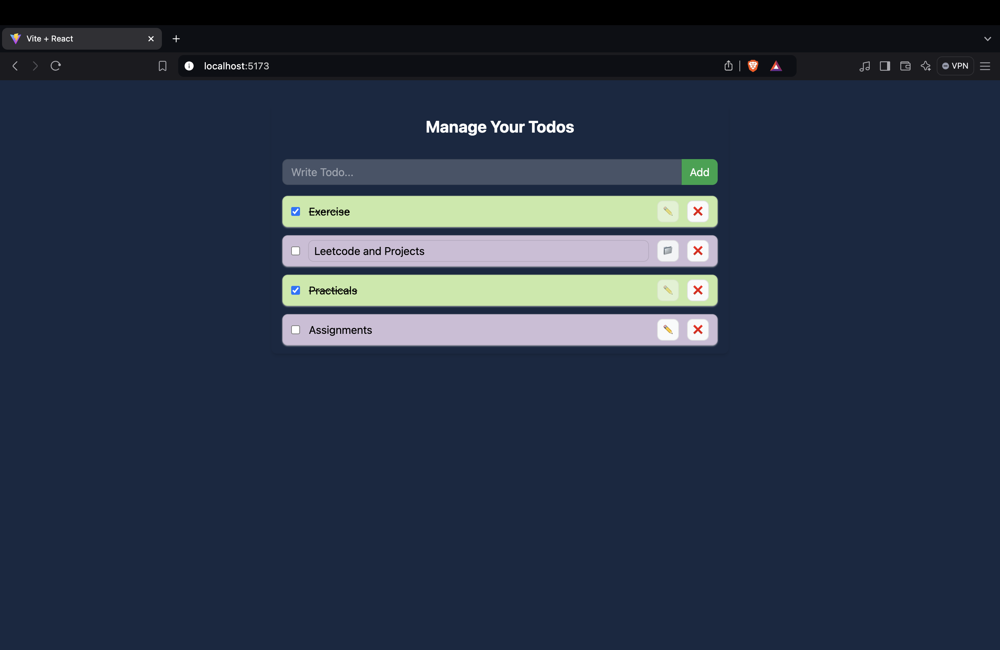

# ✅ Todo App with Context and Local Storage

This project is a **React**-based Todo List application that uses **Context API** for state management and **Local Storage** for persisting tasks. It allows users to add, remove, and mark tasks as completed while keeping the data intact even after page reloads.

## 🚀 Features

- **Add Todos**: Quickly add tasks to your todo list.
- **Mark as Completed**: Mark tasks as completed and visually differentiate them.
- **Delete Todos**: Remove tasks from the list with a single click.
- **Local Storage**: Saves the tasks so they persist across browser sessions.
- **Context API**: Manages the state efficiently across components.

## 🛠️ Technologies Used

- **React**: A JavaScript library for building user interfaces.
- **Context API**: Provides state management without the need for external libraries like Redux.
- **Local Storage**: Persists todos locally in the browser.
- **CSS**: For basic styling of the todo app.

## 🖼️ Screenshots

Todo App Interface



## 📦 Installation and Setup

To run this project locally, follow these steps:

1. **Clone the repository**:

   ```bash
   git clone https://github.com/Shravan250/React-Projects.git
   cd React-Projects/todoContextLocal

   ```

2. **Install dependencies**:

   ```bash
   npm install
   ```

3. **Start the development server**:

   ```bash
   npm run dev
   ```

4. Open your browser and navigate to `http://localhost:5173` to use the app.

## 🔄 Usage

1. Add a Todo: Use the input field to enter a task, then press "Enter" or click the add button to submit.
2. Mark Complete: Click on a todo to mark it as complete or incomplete.
3. Delete a Todo: Click the delete icon to remove a task from the list.
4. Persistence: The todos are automatically saved and loaded from the browser's local storage.

## 🛠️ Customization

To modify the Todo app:

1. State Management: Check TodoContext.js to update the logic for state handling.
2. Styling: Customize the look and feel of the app in styles.css or by adding additional CSS/SCSS files.
3. New Features: Feel free to add more features like due dates, categories, or priorities by extending the todo schema.

## 🤝 Contributing

Contributions are welcome! If you'd like to contribute:

1. Fork the repository.
2. Create a new branch.
3. Submit a pull request with your changes.

We appreciate any contributions that help make this project better!

## 📄 License

This project is licensed under the MIT License. Feel free to use and modify it as needed.

---
